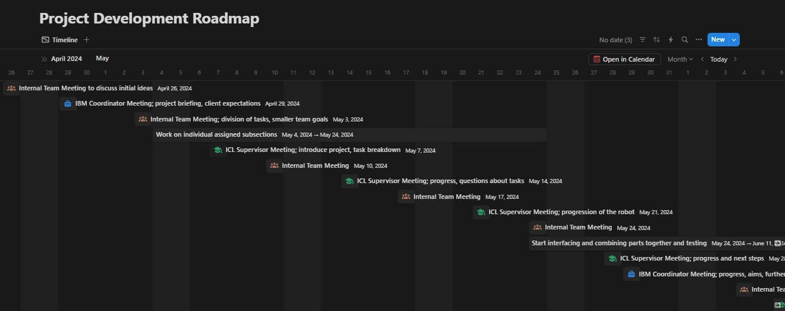

[](https://www.apache.org/licenses/LICENSE-2.0) [](https://developer.ibm.com/callforcode/solutions/projects/get-started/)

_INSTRUCTIONS: This GitHub repository serves as a template and example you can use to create a well documented README for your project for the [2024 Call for Code Global Challenge](https://developer.ibm.com/callforcode/global-challenge/)._

Your required deliverables and project descriptions should be officially submitted to your My Team > Submissions section of the [Call for Code Global Challenge web site](https://compete.callforcode.skillsnetwork.site/competitions/2024-call-for-code-global-challenge), but you can also optionally include them here for completeness, as it is good practice to clearly document your project in your README file. Replace the examples seen here with your own deliverable links.

Use the **Use this template** button to create a new version of this repository and start entering content for your own Call for Code submission project. Make sure you have [registered for the 2024 Call for Code Global Challenge](https://www.ibm.com/account/reg/signup?formid=urx-52643) to access resources and full project submission instructions. Remove any "INSTRUCTIONS" sections when you are ready to submit your project.

_New to Git and GitHub? This free online course will get you up to speed quickly: [Getting Started with Git and GitHub](https://www.coursera.org/learn/getting-started-with-git-and-github)_.

# Replace this heading with your team/submission name

- [Replace this heading with your team/submission name](#replace-this-heading-with-your-teamsubmission-name)
  - [Project summary](#project-summary)
    - [The issue we are hoping to solve](#the-issue-we-are-hoping-to-solve)
    - [How our technology solution can help](#how-our-technology-solution-can-help)
    - [Our idea](#our-idea)
  - [Technology implementation](#technology-implementation)
    - [IBM watsonx product(s) used](#ibm-watsonx-products-used)
    - [Other IBM technology used](#other-ibm-technology-used)
    - [Solution architecture](#solution-architecture)
  - [Presentation materials](#presentation-materials)
    - [Solution demo video](#solution-demo-video)
    - [Project development roadmap](#project-development-roadmap)
  - [Additional details](#additional-details)
    - [How to run the project](#how-to-run-the-project)
      - [Prerequisites](#prerequisites)
      - [Installation](#installation)
    - [Live demo](#live-demo)
  - [About this template](#about-this-template)
    - [Contributing](#contributing)
    - [Versioning](#versioning)
    - [Authors](#authors)
    - [License](#license)
    - [Acknowledgments](#acknowledgments)

_INSTRUCTIONS: Below are the suggested sections to include in your README file to make sure your project is well documented. You can remove this instruction text._

## Project summary

### The issue we are hoping to solve

We aim to address the inefficient use of water in plant care and the challenge of providing optimal growing conditions for plants, which can lead to wasted resources and suboptimal plant health.

### How our technology solution can help

Our solution autonomously relocates plants to optimal conditions, conserving water.

### Our idea

Our project focuses on developing an AI-powered irrigation robot capable of detecting optimal weather conditions for specific plants and autonomously relocating them to those conditions. This involves accessing weather data to determine local weather and optimal conditions, notifying the user via text-to-speech regarding the suitability of the local conditions, and sensing the plant’s exposure to light and moisture.

The real-world problem we identified is the inefficient use of water and the difficulty in maintaining optimal growing conditions for plants, which can lead to wasted resources and suboptimal plant health. Our technological solution addresses this by integrating IBM Watson AI and Watson Assistant to enhance the robot’s intelligence and user interaction capabilities. Watson AI processes and analyses data related to the plant’s health and environmental conditions, enabling the system to make informed decisions and provide accurate updates. Watson Assistant manages two main conversational streams: plant condition updates and weather forecasts, structured through intuitive flowcharts for seamless user interaction.

The robot integrates multiple sensors and microcontrollers with cloud services for optimal plant care. Sensors such as the DHT11, BH1750, and SEN0193, connected to the ESP32 microcontroller, continuously monitor environmental and soil conditions. The ESP32 processes this data locally and communicates via WiFi to a Mosquitto MQTT broker, which forwards data to a FastAPI server. This server stores the data in a PostgreSQL database and uses it to make decisions about the plant’s care. The TB6612FNG motor driver, controlled by the ESP32, adjusts the plant’s position based on sensor readings.

The system also includes a user-friendly website built with JavaScript, HTML, and CSS, showcasing real-time metrics collected from the sensors. Users can manually move the robot if desired and receive updates about the plant’s condition through an “Update” button. The IBM Watson chat assistant is embedded into the website, providing a personalised and responsive user experience.

This solution is an improvement over existing methods as it automates the process of monitoring and adjusting plant care based on real-time data, reducing the need for manual intervention and ensuring plants receive the care they need precisely when they need it. By minimising unnecessary water use and providing optimal care, our technology not only enhances plant growth and health but also contributes to sustainability efforts. While primarily aimed at domestic plant owners, the technology has the potential to be expanded for use in agricultural settings, where it could help address global challenges like food shortages by improving crop management and resource efficiency.

Additionally, integrating real-time analytics, machine learning, and a user interface to display these capabilities further extends the benefits of our solution. This comprehensive approach ensures that users can easily monitor and manage their plants, making informed decisions based on accurate, up-to-date information. By leveraging advanced technologies, our project offers a scalable and effective solution to the challenges of plant care and resource management, with the potential to make a significant impact on both domestic and agricultural plant care practices.

More detail is available in our [description document](./docs/DESCRIPTION.md).

## Technology implementation

### IBM watsonx product(s) used

_INSTRUCTIONS: Included here is a list of IBM watsonx products. Remove any products you did not use. Leave only those included in your solution code. In your official submission on the Call for Code Global Challenge web site, you are required to provide details on where and how you used each IBM watsonx product so judges can review your implementation. Remove these instructions._

**Featured watsonx products**

- [watsonx.ai](https://www.ibm.com/products/watsonx-ai)
- IBM Watson AI was employed to enhance the overall intelligence and functionality of the irrigation robot. It processed and analysed data related to the plant’s health and environmental conditions, enabling the system to make informed decisions and provide accurate updates.

- [watsonx.governance](https://www.ibm.com/products/watsonx-governance) - WHERE AND HOW THIS IS USED IN OUR SOLUTION

- [watsonx Assistant](https://cloud.ibm.com/catalog/services/watsonx-assistant)
- IBM Watson Assistant was integrated to create a more personalised and interactive user experience. It managed two main conversational streams:

1. Plant Condition Updates: Delivered real-time information on temperature, moisture, humidity, and light levels, allowing users to monitor and respond to changes in the plant’s health.
  
2. Weather Forecasts: Provided up-to-date meteorological data to help users plan for future environmental conditions that could affect their plants.
   
The dialogues in these streams were structured using intuitive flowcharts, ensuring seamless and user-friendly interactions. Additionally, text-to-speech capabilities were incorporated to further enhance the user experience.

### Other IBM technology used

INSTRUCTIONS: List any other IBM technology or IBM AI services used in your solution and describe how each component was used. If you can provide details on where these were used in your code, that would help the judges review your submission.

**Additional IBM AI services (Remove any that you did not use)**


- [Text to Speech](https://cloud.ibm.com/catalog/services/text-to-speech) -  IBM Watson Text to Speech was used to read out updates based on real-time data processing. The system informed the user about each attribute of the plant, including humidity, temperature, and soil moisture. By converting data into speech, the user was notified if these quantities were too high, too low, or within optimal ranges, allowing them to respond accordingly in real-time.


### Solution architecture

REPLACE THIS EXAMPLE WITH YOUR OWN, OR REMOVE THIS EXAMPLE

Diagram and step-by-step description of the flow of our solution:


1. The user navigates to the site and uploads a video file.
2. Watson Speech to Text processes the audio and extracts the text.
3. Watson Translation (optionally) can translate the text to the desired language.
4. The app stores the translated text as a document within Object Storage.

## Presentation materials

_INSTRUCTIONS: The following deliverables should be officially posted to your My Team > Submissions section of the [Call for Code Global Challenge resources site](https://cfc-prod.skillsnetwork.site/), but you can also include them here for completeness. Replace the examples seen here with your own deliverable links._

### Solution demo video
[](https://www.youtube.com/watch?v=e40uuCl1DfM)


### Project development roadmap

The project currently does the following things.

- Feature 1
- Feature 2
- Feature 3

In the future we plan to... next steps

See below for our timeline of the project development before the Call for Code 2024 submission.




## Additional details

_INSTRUCTIONS: The following deliverables are suggested, but **optional**. Additional details like this can help the judges better review your solution. Remove any sections you are not using._

### How to run the project


#### Prerequisites

Before you start, ensure you have the `ibm_cloud_sdk_core` downloaded.

#### Installation

To set up the project, follow these steps:

1. **Set up a virtual environment (optional but recommended):**
   ```bash
   python -m venv venv
   source venv/bin/activate  # On Windows use `venv\Scripts\activate`

2. **Install the required libraries:**
    ```bash
    pip install -r requirements.txt

3. **Install docker and make sure it is running**

4. **Run the application:**
    ```bash
    docker build -t ai-irrigation-chatbot . 
    docker run -p 8080:80 ai-irrigation-chatbot


5. **Navigate to http://localhost:8080/**
   Hover near the right-hand bottom corner for the chatbot, and type in update to get update. 


### Live demo

You can find a running system to test at...

See our [description document](./docs/DESCRIPTION.md) for log in credentials.

---

_INSTRUCTIONS: You can remove the below section from your specific project README._

## About this template

### Contributing

Please read [CONTRIBUTING.md](CONTRIBUTING.md) for details on our code of conduct, and the process for submitting pull requests to us.

### Versioning

We use [SemVer](http://semver.org/) for versioning. For the versions available, see the [tags on this repository](https://github.com/your/project/tags).

### Authors

<a href="https://github.com/Call-for-Code/Project-Sample/graphs/contributors">
  
</a>

- **Billie Thompson** - _Initial work_ - [PurpleBooth](https://github.com/PurpleBooth)

### License

This project is licensed under the Apache 2 License - see the [LICENSE](LICENSE) file for details.

### Acknowledgments

- Based on [Billie Thompson's README template](https://gist.github.com/PurpleBooth/109311bb0361f32d87a2).
